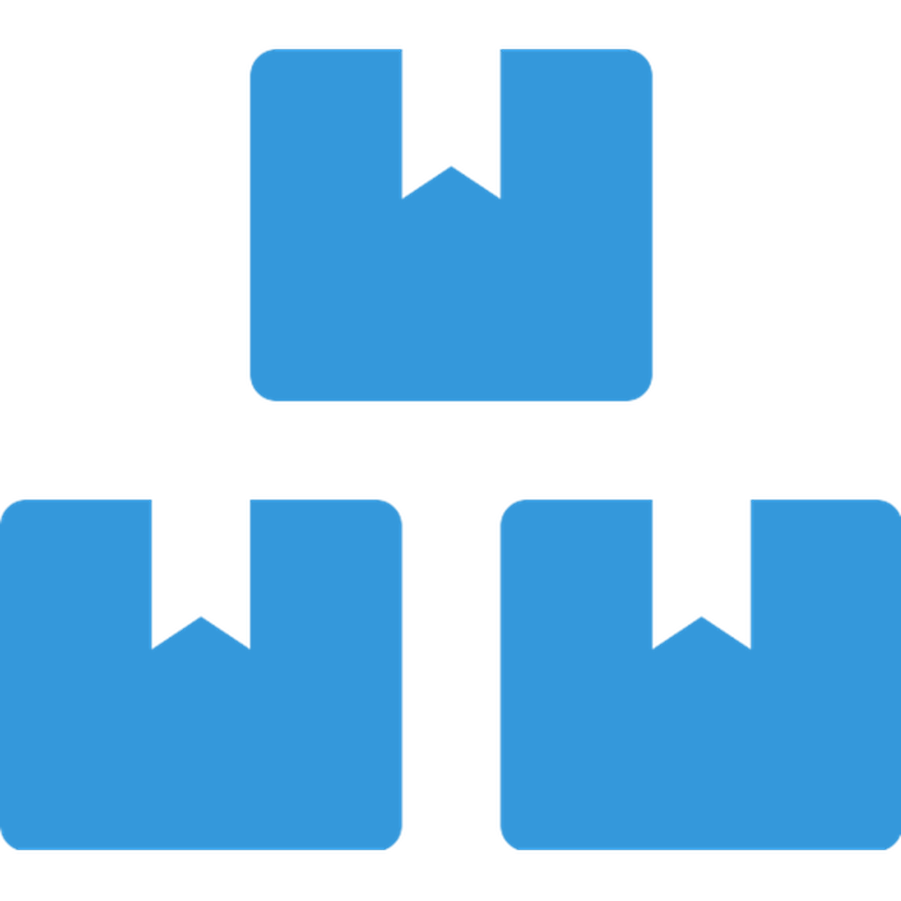
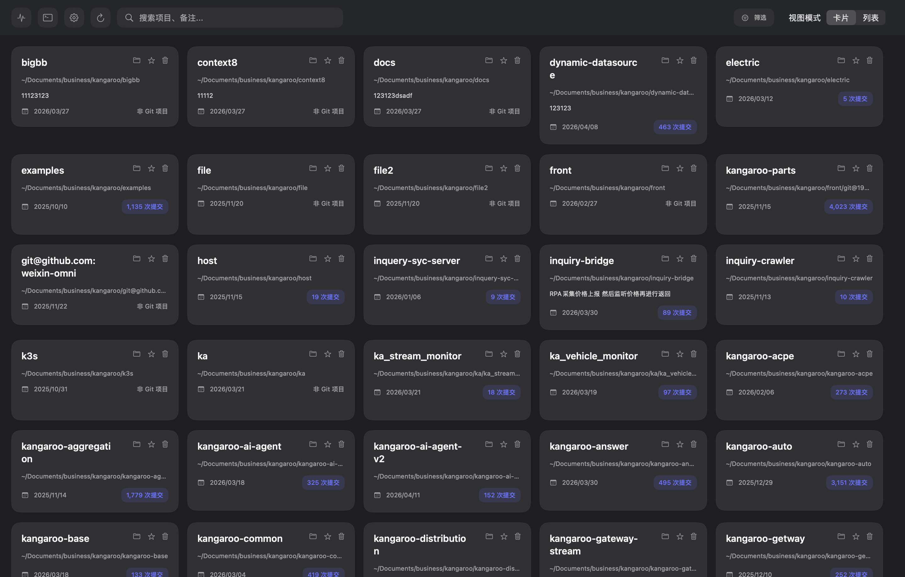
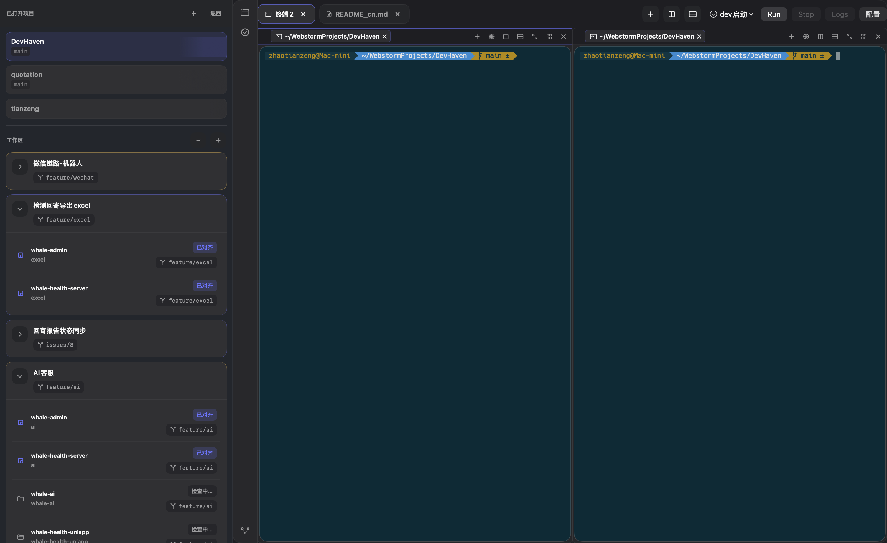
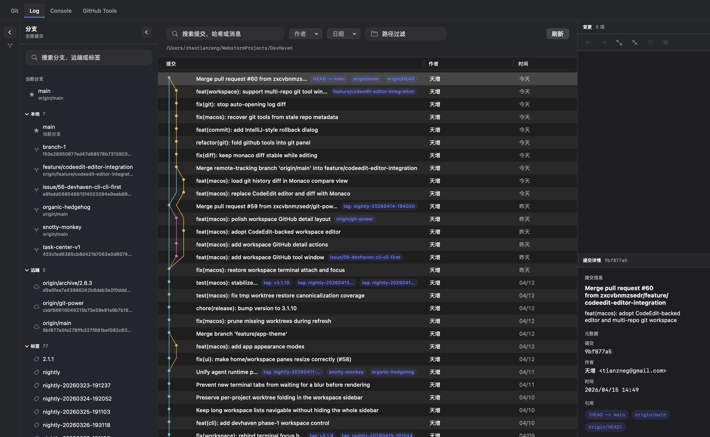
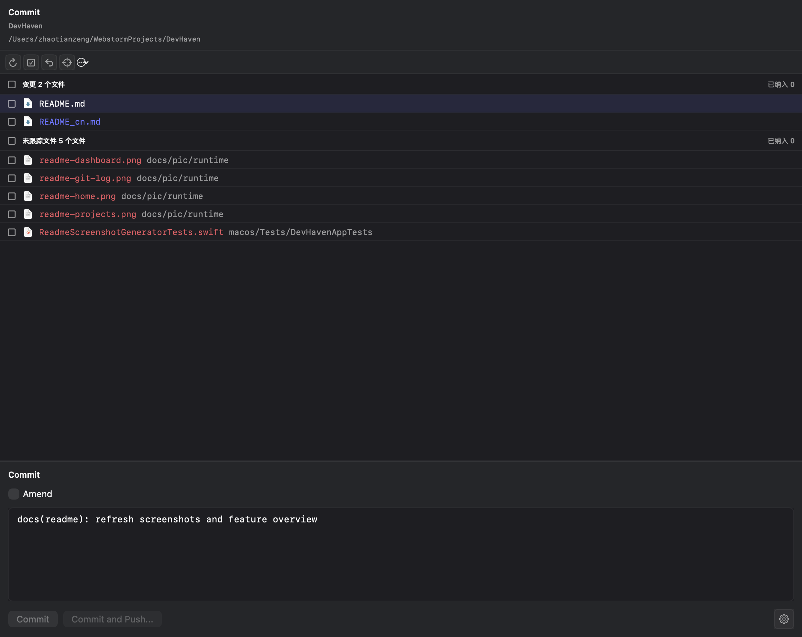
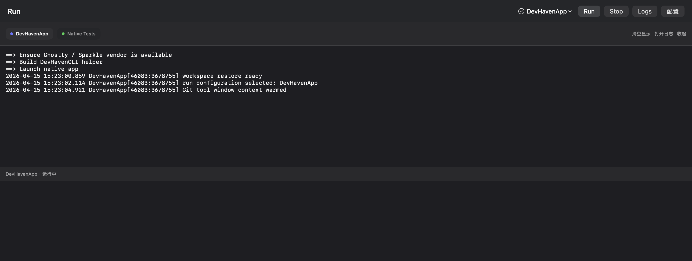

<div align="center">



# DevHaven

### Espacio de trabajo nativo para macOS orientado a la terminal

[](https://github.com/zxcvbnmzsedr/DevHaven/releases)
[](./LICENSE)
[](https://developer.apple.com/macos/)
[](https://www.swift.org/)

DevHaven ahora se centra en una **línea puramente nativa para macOS** construida con **SwiftUI + AppKit + Swift Package Manager**. Combina navegación multiproyecto, un espacio de trabajo de terminal basado en GhosttyKit, herramientas de Git / Commit / Diff, configuraciones de ejecución tipadas, notificaciones y conocimiento de sesiones de Claude / Codex en una sola aplicación.

[Destacados](#-destacados) · [Características](#-características) · [Primeros pasos](#-primeros-pasos) · [Estructura del repositorio](#-estructura-del-repositorio) · [Tecnologías](#-tecnologías) · [Documentación en chino](./README_cn.md)

</div>

---

## 🌟 Destacados

| Área | Lo que DevHaven ofrece |
|---|---|
| Shell de espacio de trabajo nativo | Una verdadera shell de aplicación macOS, no un contenedor web |
| Flujo de trabajo orientado a terminal | Pestañas de terminal basadas en GhosttyKit, paneles divididos, búsqueda y restauración del espacio de trabajo |
| Herramientas de Git | Ventana lateral de Commit, registro estilo IDEA, ramas / operaciones, y pestañas de diff reutilizables |
| Experiencia de ejecución | Configuraciones de ejecución tipadas, sesiones reutilizables y consola de ejecución en la parte inferior |
| Notificaciones y agentes | Notificaciones locales más el estado de sesiones de Claude / Codex mostrados en el espacio de trabajo |
| Distribución | Flujos locales `./dev` y `./release`, metadatos de Sparkle, canal estable + noche (nightly) |

---

## ✨ Características

### 🗂 Centro de proyectos y navegación multiproyecto

- Escanea un directorio de trabajo y descubre repositorios Git rápidamente.
- Importa repositorios específicos directamente y mantenlos en la lista de proyectos.
- Abre múltiples proyectos en el mismo espacio de trabajo sin interrumpir las sesiones de terminal existentes.
- Administra acciones relacionadas con worktrees desde el flujo de navegación del proyecto.
- Mantén la navegación del proyecto separada del chrome del espacio de trabajo para mantener la terminal y las ventanas de herramientas enfocadas.

<p align="center">
  
</p>

### 💻 Espacio de trabajo nativo orientado a terminal

- Construido sobre **GhosttyKit**, por lo que la terminal está respaldada por un motor nativo en lugar de un contenedor web.
- Soporta pestañas de espacio de trabajo, paneles divididos, enfoque de enrutamiento de paneles y reutilización de paneles.
- Integra la búsqueda en el flujo de trabajo del menú de macOS.
- Preserva el contexto del espacio de trabajo mediante instantáneas de restauración, por lo que regresar a la app no se siente como comenzar de nuevo.
- Incluye wrappers de shell integrados para la integración de Claude / Codex y mantiene la ruta normalizada incluso cuando los archivos de inicio del shell reescriben `PATH`.

<p align="center">
  
</p>

### 🧾 Ventanas de herramientas de Git, Commit y Diff

- Una ventana lateral dedicada a **Commit** para cambios preparados / no preparados / no rastreados, opciones de inclusión, edición de borradores de commit, opciones de amend / firmar / autor y retroalimentación de ejecución.
- Una ventana inferior dedicada a **Git** para ramas, operaciones remotas y un flujo de trabajo de registro estilo IDEA.
- Renderizado estructurado del gráfico de commits, filtros de registro, navegador de cambios y detalles de commit en la vista del registro de Git.
- Pestañas de diff reutilizables abiertas desde el registro de Git o cambios del árbol de trabajo, en lugar de vistas previas sueltas.
- Visores de parche, comparación bidireccional y resolución de fusiones para diffs de historial y conflictos en el árbol de trabajo.

<p align="center">
  
</p>

<p align="center">
  
</p>

### ▶️ Configuraciones de ejecución, notificaciones y estado de agentes

- Configuraciones de ejecución tipadas unidas a cada proyecto, con soporte inicial para `customShell` y `remoteLogViewer`.
- Una barra de herramientas ligera de ejecución en la parte superior del espacio de trabajo y una consola de ejecución reutilizable en la parte inferior para salida en vivo.
- Persistencia de logs en `~/.devhaven/run-logs/` para poder inspeccionar sesiones después.
- Integración del popover de notificaciones locales y del sistema para eventos del espacio de trabajo.
- Seguimiento de señales de sesiones de Claude / Codex, accesorios de estado de agentes y heurísticas en tiempo real que distinguen trabajo activo de estados de espera.

<p align="center">
  
</p>

### 🔄 Pipeline nativo de distribución y actualización

- Los metadatos de Sparkle están integrados en las builds de lanzamiento.
- Los canales estable y nocturno (nightly) están modelados en los metadatos de la app y en los workflows de GitHub.
- Las builds públicas actualmente usan **descarga manual**, lo que significa que DevHaven puede comprobar actualizaciones y redirigirte a la página de descarga.
- El repositorio incluye scripts para empaquetado local de app, ensamblaje de app universal, generación de appcast y promoción de etapas a alias.

---

## 🚀 Primeros pasos

### Requisitos

| Requisito | Versión / Notas |
|---|---|
| macOS | 14.0+ |
| Swift / Xcode | Swift 6 y Xcode o Herramientas de Línea de Comandos |
| Git | Cualquier versión reciente |
| Fuente de Ghostty | Necesaria solo si debes iniciar `macos/Vendor` desde cero |

### Descarga

- **Estable**: descarga el último lanzamiento estable desde la [página de GitHub Releases](https://github.com/zxcvbnmzsedr/DevHaven/releases)
- **Nocturno / preestreno**: consulta las pre-publicaciones de GitHub publicadas por el workflow nocturno (nightly)

> **Nota de seguridad de macOS**
>
> DevHaven aún no está notariado. Si macOS bloquea la app en el primer lanzamiento, elimina el atributo de cuarentena:
>
> ```bash
> sudo xattr -r -d com.apple.quarantine "/Applications/DevHaven.app"
> ```

### Construir desde el código fuente

Si otra worktree de DevHaven en tu máquina ya tiene preparado `macos/Vendor`, `./dev` puede reutilizarlo automáticamente. En una máquina limpia, inicia Ghostty y Sparkle primero:

```bash
git clone https://github.com/zxcvbnmzsedr/DevHaven.git
cd DevHaven

# Vendor de Ghostty: compilar o reutilizar artefactos de tu checkout local de la fuente de Ghostty
bash macos/scripts/setup-ghostty-framework.sh --source /path/to/ghostty

# Vendor de Sparkle: reutilizar otra worktree si es posible, de lo contrario descargar automáticamente
bash macos/scripts/setup-sparkle-framework.sh --ensure-worktree-vendor

# Probar y ejecutar
swift test --package-path macos
./dev
```

### Flujo de trabajo de desarrollo

```bash
# Iniciar la app nativa en modo de desarrollo
./dev

# Solo transmitir logs de DevHaven
./dev --logs app

# Desactivar la transmisión unificada de logs
./dev --no-log

# Imprimir los comandos sin ejecutarlos
./dev --dry-run
```

`./dev` hará:

1. Asegurar que los recursos de vendor de Ghostty y Sparkle estén disponibles
2. Compilar el helper `DevHavenCLI`
3. Opcionalmente adjuntar transmisión de logs unificados
4. Lanzar `swift run --package-path macos DevHavenApp`

### Build de lanzamiento

```bash
# Build de lanzamiento local estándar
./release

# Build de lanzamiento sin abrir Finder después
./release --no-open

# Uso directo del script si necesitas un canal o número de build personalizado
bash macos/scripts/build-native-app.sh --release --update-channel nightly --build-number 3011001 --no-open
```

### Configuración del terminal integrado

DevHaven lee la configuración de Ghostty en este orden:

1. `~/.devhaven/ghostty/config`
2. `~/.devhaven/ghostty/config.ghostty`
3. Respaldo a la configuración global de Ghostty en `~/Library/Application Support/com.mitchellh.ghostty/`

---

## 📖 Flujo de trabajo típico

1. **Añade repositorios** escaneando un directorio padre o importando rutas específicas.
2. **Abre un proyecto en el espacio de trabajo** manteniendo pestañas / paneles vivos mientras abres más proyectos.
3. **Trabaja en la terminal** usando paneles respaldados por Ghostty, búsqueda integrada en el menú y sesiones con memoria de restauración.
4. **Revisa cambios** en las ventanas de herramientas Commit o Git.
5. **Abre pestañas de diff reutilizables** para diffs de historial, comparaciones del árbol de trabajo o resolución de fusiones.
6. **Ejecuta comandos del proyecto** mediante configuraciones de ejecución por proyecto e inspecciona logs en la consola inferior.

---

## 🗃 Estructura del repositorio

| Ruta | Propósito |
|---|---|
| `dev` | Punto de entrada de desarrollo local que prepara recursos de vendor, inicia la transmisión de logs y ejecuta la app |
| `release` | Punto de entrada de empaquetado de lanzamiento local que delega a `macos/scripts/build-native-app.sh --release` |
| `macos/Package.swift` | Entrada Swift Package para la app nativa, módulo central y helper CLI |
| `macos/Sources/DevHavenApp/` | Shell nativo de macOS, host de Ghostty, UI de espacio de trabajo, integración de actualizaciones, recursos de agentes integrados |
| `macos/Sources/DevHavenCore/` | Modelos, almacenamiento, servicios de Git, coordinación de restauración, gestión de ejecución y view models |
| `macos/scripts/` | Herramientas de arranque de vendor, empaquetado de app, ensamblaje de app universal y herramientas de appcast |
| `docs/pic/` | Capturas de pantalla del README |
| `.github/workflows/` | Automatización de lanzamiento estable y entrega nocturna (nightly) |

---

## 🛠 Tecnologías

| Capa | Tecnología |
|---|---|
| Shell de UI | SwiftUI + AppKit |
| Empaquetado / construcción | Swift Package Manager |
| Motor de terminal | [GhosttyKit](https://ghostty.org/) |
| Actualizaciones | [Sparkle](https://sparkle-project.org/) |
| Integración de Git | Servicios CLI nativos de Git |
| Almacenamiento en tiempo de ejecución | Compatibilidad con `~/.devhaven/*` y stores de tiempo de ejecución |

---

## 🤝 Contribuir

Los issues y pull requests son bienvenidos. Para cambios significativos, por favor abre primero un issue para poder discutir el enfoque de implementación antes de que el código se integre.

---

## 📄 Licencia

[GPL-3.0](./LICENSE)
