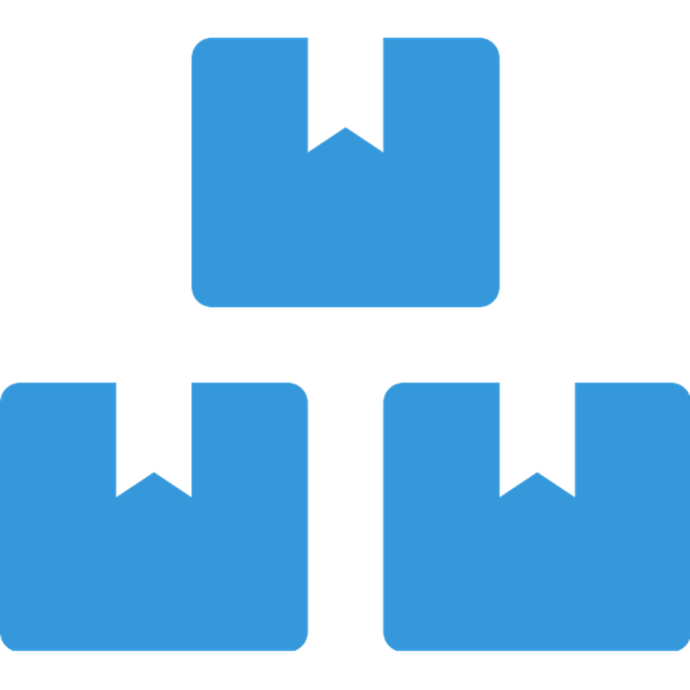

<div align="center">



# DevHaven

### The macOS developer workspace for people who live in the terminal

[](https://github.com/zxcvbnmzsedr/DevHaven/releases)
[](./LICENSE)
[](https://developer.apple.com/macos/)
[](https://www.swift.org/)

DevHaven is a **native macOS app** built with SwiftUI + AppKit that brings all your projects into one place — with a built-in terminal powered by GhosttyKit, Git activity visualization, and worktree management, all without leaving the app.

[Features](#-features) · [Screenshots](#-screenshots) · [Getting Started](#-getting-started) · [Usage](#-usage) · [Tech Stack](#-tech-stack) · [中文文档](./README_cn.md)

</div>

---

## 🖼 Screenshots

**Main Interface — Project List**


---

**Git Activity Dashboard**


---

**Terminal Workspace**


---


## ✨ Features

### 🗂 Smart Project Management
- **Directory scanning** — point DevHaven at a folder and it auto-discovers all Git projects inside
- **Persistent imports** — manually add any project and it stays in your list across refreshes
- **Flexible filtering** — filter by tags, directory, keyword, date range, and Git status

### 📊 Git Visualization
- **Commit heatmap** — daily coding activity at a glance, styled like GitHub's contribution graph
- **Stats dashboard** — commit counts, activity scores, and time-based breakdowns per project
- **Branch & Worktree view** — inspect branch status and manage worktree lifecycles in one place

### 💻 Native Terminal Workspace
- **Multi-project** — open several projects side-by-side, each with its own persistent session
- **Tabs & split panes** — full tab management, split panes, focus switching, and pane lifecycle control
- **GhosttyKit engine** — the terminal is driven by the same native kernel used by [Ghostty](https://ghostty.org/), not a web-based shell
- **Session persistence** — workspaces stay mounted when you navigate away, so your terminal is never accidentally killed

---

## 🚀 Getting Started

### Requirements

| Requirement | Version |
|---|---|
| macOS | 14.0+ |
| Swift / Xcode | Swift 6 + Xcode or CLT |
| Git | any recent version |

### Download

Grab the latest release from the [Releases page](https://github.com/zxcvbnmzsedr/DevHaven/releases).

> **⚠️ macOS Security Notice**
> DevHaven is not notarized yet. If macOS blocks the app on first launch, run:
> ```bash
> sudo xattr -r -d com.apple.quarantine "/Applications/DevHaven.app"
> ```

### Build from Source

```bash
# 1. Clone
git clone https://github.com/zxcvbnmzsedr/DevHaven.git
cd DevHaven

# 2. Prepare Ghostty vendor (replace path with your local ghostty source)
bash macos/scripts/setup-ghostty-framework.sh --source /path/to/ghostty --skip-build

# 3. Prepare Sparkle vendor
bash macos/scripts/setup-sparkle-framework.sh --ensure-worktree-vendor

# 4. Run tests
swift test --package-path macos

# 5. Build release app
./release
```

### Development Mode

```bash
# Start app with live logs (nearest to `pnpm dev`)
./dev

# Only stream DevHaven's own logs
./dev --logs app

# Skip log streaming
./dev --no-log

# Dry-run (print commands without executing)
./dev --dry-run
```

> `./dev` auto-syncs the vendor directory from a sibling worktree if available, then starts `swift run --package-path macos DevHavenApp`.

### Terminal Config

DevHaven's embedded Ghostty terminal reads config in this order:

1. `~/.devhaven/ghostty/config` or `~/.devhaven/ghostty/config.ghostty`
2. Falls back to your global Ghostty config at `~/Library/Application Support/com.mitchellh.ghostty/config*`

---

## 📖 Usage

### Step 1 — Add Projects

**Scan a directory**
1. Open the sidebar and add a working directory
2. DevHaven scans all subdirectories and builds a project list automatically
3. Click any project to see details or open it in the workspace

**Import a specific project**
- Add a project path directly — it will persist across directory refreshes

### Step 2 — Work in the Terminal

- Double-click a project to open it in the workspace
- Add more projects to the same workspace without closing existing terminals
- Use tabs and split panes to organize your work
- Manage worktrees, check Git status, and run commands — all in one window

---

## 🛠 Tech Stack

| Layer | Technology |
|---|---|
| Desktop shell | SwiftUI + AppKit |
| Build tool | Swift Package Manager |
| Terminal engine | [GhosttyKit](https://ghostty.org/) |
| Auto-update | [Sparkle](https://sparkle-project.org/) |
| Data compatibility | LegacyCompatStore (`~/.devhaven/*`) |
| Git / Worktree | Native Git CLI + `NativeGitWorktreeService` |

---

## 🤝 Contributing

Issues and PRs are welcome. Please open an issue first for significant changes so we can discuss the approach.

---

## 📄 License

[GPL-3.0](./LICENSE)

