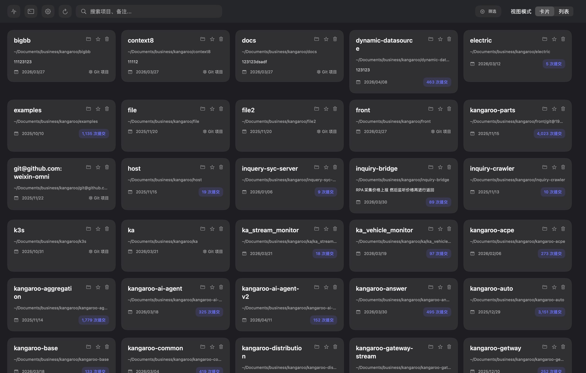
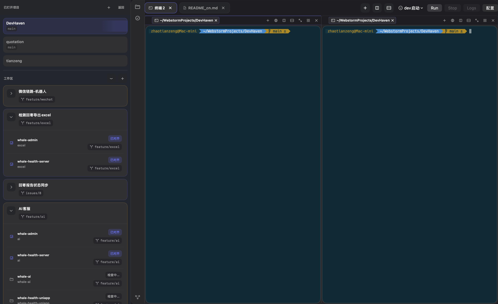
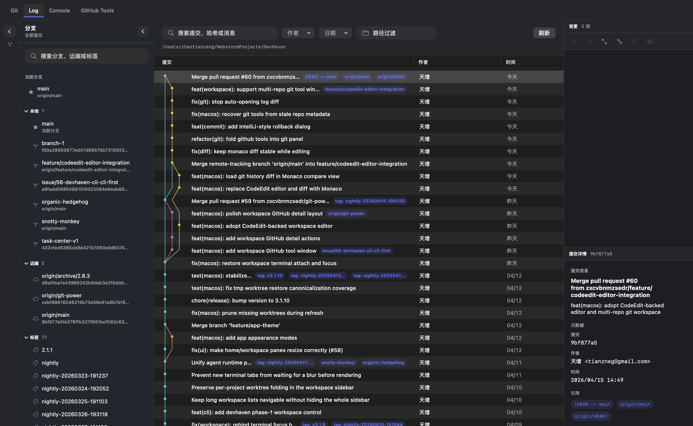
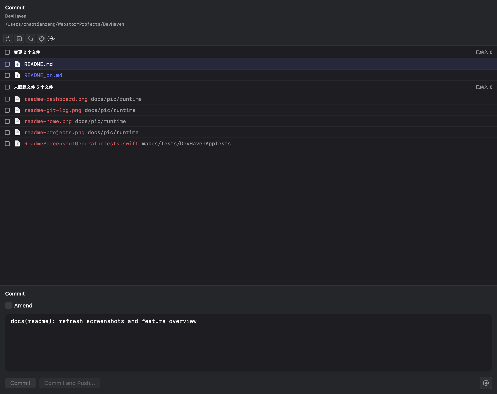
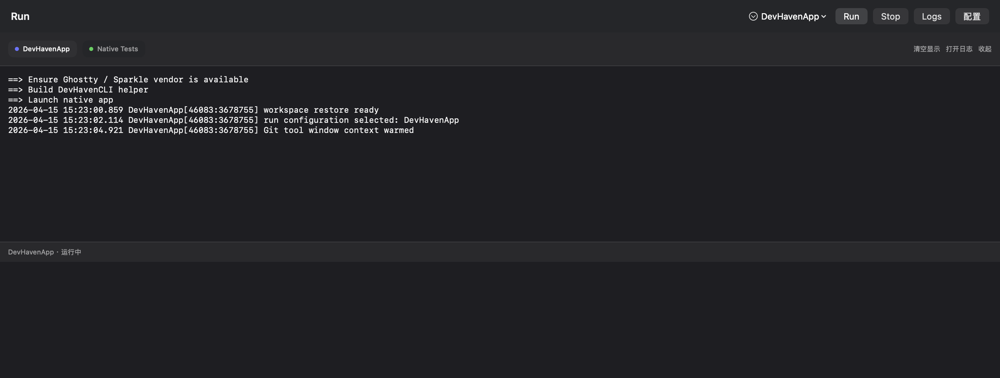

<div align="center">


# DevHaven

### 纯 macOS 原生开发工作区：项目、终端、Git、Run、通知与 Agent 状态统一收口

[](https://github.com/zxcvbnmzsedr/DevHaven/releases)
[](./LICENSE)
[](https://developer.apple.com/macos/)
[](https://www.swift.org/)

DevHaven 已经收口为一条 **纯 macOS 原生主线**：基于 **SwiftUI + AppKit + Swift Package Manager** 构建，把多项目导航、GhosttyKit 驱动的终端工作区、Git / Commit / Diff 工具窗、typed run configuration、通知系统，以及 Claude / Codex 会话感知能力收进同一个应用里。

[亮点概览](#-亮点概览) · [功能特性](#-功能特性) · [快速开始](#-快速开始) · [仓库结构](#-仓库结构) · [技术栈](#-技术栈) · [English](./README.md)

</div>

---

## 🌟 亮点概览

| 领域 | DevHaven 当前提供的能力 |
|---|---|
| 原生工作区壳 | 真正的 macOS 原生工作区，而不是浏览器壳或 WebView IDE |
| 终端优先体验 | 基于 GhosttyKit 的终端标签、分屏、搜索与工作区恢复 |
| Git 工具链 | Commit 侧边工具窗、IDEA 风格 Git Log、Branches / Operations、独立 Diff 标签页 |
| 运行体验 | 项目级 typed 运行配置、可复用会话、底部 Run Console |
| 通知与 Agent 状态 | 本地通知、Workspace 内未读状态，以及 Claude / Codex 会话状态展示 |
| 发布链路 | 本地 `./dev` / `./release`、Sparkle 元数据、stable + nightly 交付流程 |

---

## ✨ 功能特性

### 🗂 项目中心与多项目导航

- 扫描工作目录，快速发现其中的 Git 仓库。
- 直接导入指定仓库，并将其持续保留在项目列表中。
- 在同一个 workspace 内打开多个项目，不会回收已经存在的终端会话。
- 在项目导航流中统一承接 worktree 相关操作。
- 将项目导航与 workspace chrome 解耦，让主内容区持续聚焦于终端与工具窗。

<p align="center">
  
</p>

### 💻 终端优先的原生工作区

- 基于 **GhosttyKit**，终端内核是真正的原生终端引擎，而不是 Web 终端封装。
- 支持 workspace 标签页、分屏 pane、焦点路由与 pane 复用。
- 终端搜索与 macOS 菜单命令联动，符合桌面应用的使用习惯。
- 通过 restore snapshot 保留工作区上下文，返回应用时不需要“从零再开一遍”。
- 内置 Claude / Codex wrapper，并处理 shell startup 可能改写 `PATH` 的问题，确保 wrapper 优先级稳定。

<p align="center">
  
</p>

### 🧾 Git、Commit 与 Diff 工具窗

- 独立的 **Commit** 侧边工具窗：覆盖 staged / unstaged / untracked 变更、inclusion toggle、提交草稿、amend / sign-off / author 选项与执行反馈。
- 独立的 **Git** 底部工具窗：覆盖分支、远端操作，以及 IDEA 风格的 Git Log 主链。
- Git Log 具备结构化 commit graph、filter toolbar、changes browser 与 commit details。
- 从 Git Log 或 working tree 打开的 diff 会复用独立 diff 标签页，而不是散落的临时 preview。
- 支持 patch viewer、two-side compare viewer、merge viewer，用于历史 diff、工作区对比和冲突解决。

<p align="center">
  
</p>

<p align="center">
  
</p>

### ▶️ Run 配置、通知系统与 Agent 状态

- 每个项目都可以挂载 typed run configuration，首批支持 `customShell` 与 `remoteLogViewer`。
- Workspace 顶部有轻量 Run Toolbar，底部有可复用的 Run Console，用于承接实时输出。
- 运行日志会落到 `~/.devhaven/run-logs/`，便于事后回看。
- 提供本地通知 popover 与系统通知集成，用于承接 workspace 事件。
- 通过 signal store、状态附件与运行期启发式，将 Claude / Codex 的 running / waiting 等状态直接展示在 workspace 中。

<p align="center">
  
</p>

### 🔄 原生发布与更新链路

- Release 包会写入 Sparkle 所需的更新元数据。
- stable 与 nightly 两条更新通道都已经在应用元数据与 GitHub workflow 中建模。
- 当前公开分发默认采用 **manual download** 模式：应用内可检查更新，并跳转下载页完成升级。
- 仓库内已经包含本地打包、universal app 合成、appcast 生成与 staged alias promote 的脚本链路。

---

## 🚀 快速开始

### 系统要求

| 依赖 | 版本 / 说明 |
|---|---|
| macOS | 14.0+ |
| Swift / Xcode | Swift 6 + Xcode 或 Command Line Tools |
| Git | 任意近期版本 |
| Ghostty 源码 | 仅在你需要从零准备 `macos/Vendor` 时才需要 |

### 下载使用

- **Stable 版本**：前往 [GitHub Releases](https://github.com/zxcvbnmzsedr/DevHaven/releases) 下载最新稳定版
- **Nightly / 预览版本**：查看 nightly workflow 发布的 GitHub 预发布版本

> **macOS 安全提示**
>
> DevHaven 目前还没有完成公证。如果首次启动被 macOS 拦截，可移除隔离属性：
>
> ```bash
> sudo xattr -r -d com.apple.quarantine "/Applications/DevHaven.app"
> ```

### 从源码构建

如果你机器上的另一个 DevHaven worktree 已经准备好了 `macos/Vendor`，那么 `./dev` 会优先自动复用。若是全新环境，请先准备 Ghostty 与 Sparkle vendor：

```bash
git clone https://github.com/zxcvbnmzsedr/DevHaven.git
cd DevHaven

# Ghostty vendor：从你本机的 Ghostty 源码目录构建或复用产物
bash macos/scripts/setup-ghostty-framework.sh --source /path/to/ghostty

# Sparkle vendor：优先复用其他 worktree；没有的话自动下载
bash macos/scripts/setup-sparkle-framework.sh --ensure-worktree-vendor

# 测试并启动
swift test --package-path macos
./dev
```

### 开发态启动

```bash
# 启动原生开发态应用
./dev

# 只看 DevHaven 自身日志
./dev --logs app

# 不接入 unified log
./dev --no-log

# 仅打印将要执行的命令
./dev --dry-run
```

`./dev` 会依次完成：

1. 确保 Ghostty / Sparkle vendor 可用
2. 构建 `DevHavenCLI` helper
3. 按需接入 unified log
4. 启动 `swift run --package-path macos DevHavenApp`

### Release 打包

```bash
# 标准本地 release 构建
./release

# 构建完成后不自动打开 Finder
./release --no-open

# 需要自定义通道或 build number 时，直接调用底层脚本
bash macos/scripts/build-native-app.sh --release --update-channel nightly --build-number 3011001 --no-open
```

### 内嵌终端配置

DevHaven 会按以下顺序读取 Ghostty 配置：

1. `~/.devhaven/ghostty/config`
2. `~/.devhaven/ghostty/config.ghostty`
3. 回退到 `~/Library/Application Support/com.mitchellh.ghostty/` 下的全局 Ghostty 配置

---

## 📖 典型工作流

1. **添加仓库**：扫描父目录或手动导入指定路径。
2. **进入 workspace**：把一个或多个项目挂进同一个工作区。
3. **在终端中工作**：使用 Ghostty 驱动的标签页、分屏、菜单搜索与恢复能力。
4. **查看与整理变更**：通过 Commit 或 Git 工具窗浏览变更、提交与日志。
5. **打开独立 Diff 标签页**：用于历史 diff、working tree compare 或 merge 冲突解决。
6. **运行项目命令**：通过项目级 run configuration 启动任务，在底部 console 查看输出。

---

## 🗃 仓库结构

| 路径 | 说明 |
|---|---|
| `dev` | 本地开发入口：准备 vendor、接日志、启动应用 |
| `release` | 本地 release 打包入口：委托 `macos/scripts/build-native-app.sh --release` |
| `macos/Package.swift` | 原生 App、Core 模块与 CLI helper 的 Swift Package 入口 |
| `macos/Sources/DevHavenApp/` | 原生 macOS UI、Ghostty 宿主、workspace 视图、更新集成、AgentResources |
| `macos/Sources/DevHavenCore/` | 模型、存储、Git 服务、restore、run 管理与 ViewModel |
| `macos/scripts/` | vendor 准备、App 打包、universal app、appcast 工具链 |
| `docs/pic/` | README 所用截图 |
| `.github/workflows/` | stable release 与 nightly 交付自动化 |

---

## 🛠 技术栈

| 层级 | 技术 |
|---|---|
| UI 壳层 | SwiftUI + AppKit |
| 包管理 / 构建 | Swift Package Manager |
| 终端内核 | [GhosttyKit](https://ghostty.org/) |
| 更新能力 | [Sparkle](https://sparkle-project.org/) |
| Git 集成 | 原生 Git CLI 服务链 |
| 运行期存储 | `~/.devhaven/*` 兼容层与运行时存储 |

---

## 🤝 贡献

欢迎提交 Issue 和 PR。若改动较大，建议先开 Issue 讨论实现方向，再进入代码修改。

---

## 📄 开源协议

本项目基于 [GPL-3.0](./LICENSE) 开源。
